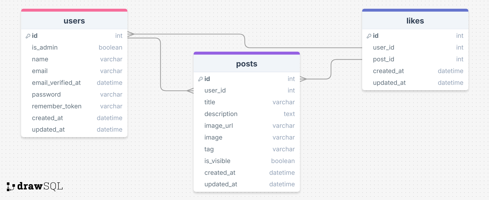

# Changelog Laravel Eindopdracht PRG5

## 24/10/2024
* Bug Fixes en styling
* Like button toegevoegd

## 23/10/2024
* Bug Fixes en styling

## 22/10/2024
* Zoekfunctie toegevoegd
* Tags aan zoekfunctie toegevoegd

## 21/10/2024
* Form validation toegevoegd
* Admin visibility toggle gemaakt
* Zoekbalk toegevoegd

## 20/10/2024
* User Stories bijgewerkt

## 19/10/2024
* Delete toegevoegd
* Update toegevoegd
* Users kunnen nu zelf afbeeldingen uploaden

## 18/10/2024
* Adminpagina toegevoegd
* Adminpagina beveiligd

## 17/10/2024
* Tailwind-styling toegevoegd
* Teksten, logo's en afbeeldingen toegevoegd
* Nieuwe dummy-data aan de database toegevoegd
* Styling aan formulier toegevoegd

## 16/10/2024
* Styling aan overzicht toegevoegd
* Create functionaliteit gemaakt
* One-to-many relaties gemaakt

## 15/10/2024
* Database gemaakt
* Migrations uitgevoerd
* Database data op posts-pagina
* Detailpagina posts gemaakt

## 14/10/2024
* Database gemaakt
* Check voor ingelogde gebruikers gemaakt
* Navigatie en styling toegevoegd

## 13/10/2024
* Routes en views aangemaakt

## 12/10/2024
* User Stories gemaakt
* ERD gemaakt
* _Note: ERD en User Stories staan onderaan in de Changelog_

## 11/10/2024
* Onderwerp eindopdracht gekozen

## 10/10/2024
* Lesopdrachten afgemaakt
* Onderzoeksverslag afgemaakt

## 09/10/2024
* Nieuw Laravel project aangemaakt
* GitHub repository aangemaakt
* Breeze-authenticatie aangemaakt

## ERD

## User Stories
* Als User wil ik een account aan kunnen maken.
* Als User wil ik mijn gegevens kunnen aanpassen.
* Als User wil ik posts kunnen bekijken.
* Als User wil ik posts kunnen liken.
* Als User wil ik posts kunnen plaatsen.
* Als User wil ik mijn posts kunnen bewerken.
* Als User wil ik mijn posts kunnen verwijderen.
* Als User wil ik posts kunnen zoeken.
* Als Admin wil ik posts kunnen tonen of verbergen.
* Als Admin wil ik posts kunnen verwijderen.
* Als Admin wil ik posts kunnen bewerken.

## TODO:
* User moet posts kunnen liken.
* User kan pas posten na vijf likes.
* Posts moeten worden gesorteerd op likes of datum.
